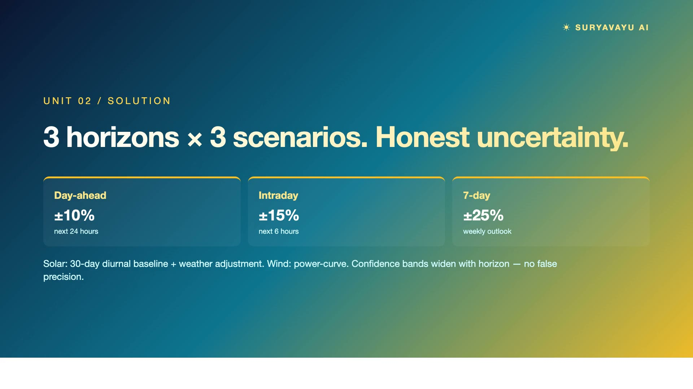
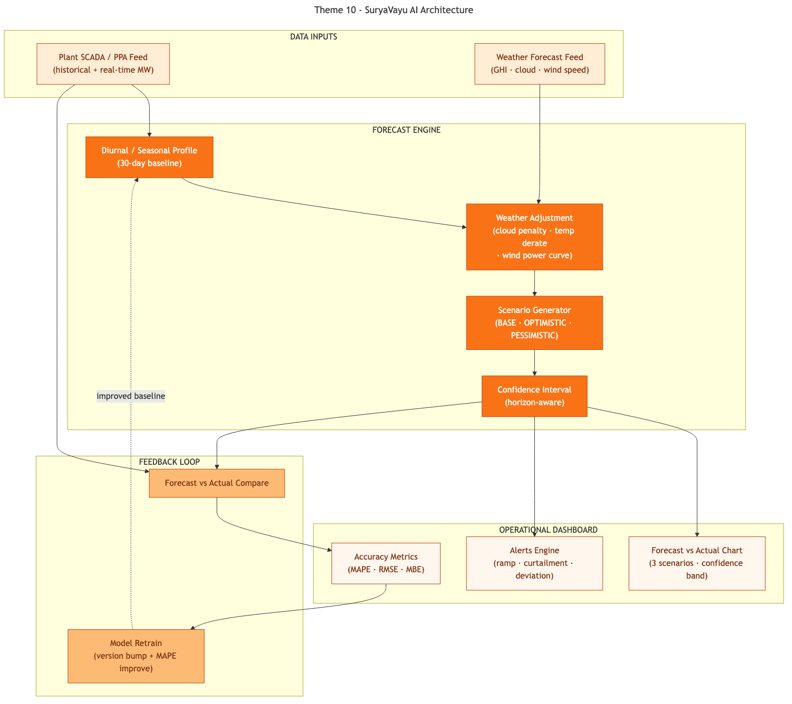

# SuryaVayu AI — Renewable Generation Forecasting for KREDL & KSPDCL

> **PanIIT AI for Bharat 2026 — Theme 10** · **Sponsor:** KREDL / KSPDCL
> Predict · Explain · Recommend

[](https://youtu.be/C0lNOAyChXY)

▶ **[Watch the 5-minute demo](https://youtu.be/C0lNOAyChXY)**

---

## What it solves

Karnataka's grid increasingly depends on solar and wind generation. Both are inherently variable — clouds drop solar output 60% in an hour, wind ramps 40% within 15 minutes. Grid operators need reliable day-ahead forecasts to schedule conventional generation, avoid curtailment, and manage reserve margins. India's forecast accuracy trails global benchmarks by 3–5 percentage points on MAPE. SuryaVayu turns guesses into grounded forecasts.

## Key features

- **3 horizons × 3 scenarios** — 6H / Day-Ahead / Week × Base / Optimistic / Pessimistic with confidence bands that widen honestly with horizon
- **Single feature-conditioned engine** — plantType is a feature, not a model selector — one pipeline for solar and wind
- **"Why this forecast?" attribution** — Every hour decomposed: baseline + cloud penalty + temp derate + wind factor + scenario adjustment
- **Drift detector → retrain → auto-ack** — Closes the model lifecycle automatically
- **Cluster-level aggregates** — By district + asset type with sum-of-variances confidence bounds
- **Baseline comparison** — vs persistence (−72%) and seasonal-naive (−95%) — brief criterion
- **Curtailment ₹ estimate** — Using KREDL PPA rate
- **AI Daily Briefing + Grid Analysis + Alert Explanations + Model Report** — All grounded — GPT-4.1 only describes physics-model numbers
- **Real weather data** — 90 days × hourly Open-Meteo for 9 plants across Karnataka (free, no API key)

## Architecture



> Source: [`docs/diagrams/architecture.mmd`](docs/diagrams/architecture.mmd) (Mermaid)

## Quick start

### Prerequisites

| Tool | Version |
|------|---------|
| Node.js | 18+ |
| npm | 9+ |

> No Python. No Docker. SQLite is bundled.

### Setup

```bash
# 1. Install
npm install

# 2. Configure environment (optional — without keys, AI falls back to deterministic templates)
cat > .env.local <<'EOF'
AZURE_OPENAI_API_KEY=your_key
AZURE_OPENAI_ENDPOINT=https://<resource>.openai.azure.com/openai/deployments/<deployment>/chat/completions?api-version=2025-01-01-preview
EOF

# 3. Set up the database
npx prisma generate
npx prisma migrate dev --name init

# 4. Seed demo data
npm run seed

# 5. Run the dev server
npm run dev
```

Open <http://localhost:3000>.

### One-liner

```bash
npm install && npx prisma generate && npx prisma migrate dev --name init && npm run seed && npm run dev
```


## Demo flow

1. Land on `/` for **AI Morning Briefing** + KPI strip + dispatch action card + plant map
2. Click any plant on the map → Forecast tab
3. Toggle horizon (Day-Ahead / 7-day) → confidence bands widen honestly
4. Toggle scenarios (Base / Optimistic / Pessimistic)
5. Scroll to attribution stacked bar + AI Grid Analysis card
6. `/clusters` — district + asset-type aggregates
7. `/alerts` — ramp events + curtailment risk + model drift, each with AI explanation
8. `/models` → **Retrain** → drift loop closes (new version + auto-ack)

> **Demo data:** 9 plants (6 solar + 3 wind) across Karnataka · 90 days × 24h hourly generation + weather per plant · forecasts for 3 horizons × 3 scenarios · cluster aggregates · MAPE / RMSE / MBE accuracy records · alerts · 3 model versions

## Tech stack

| Layer | Technology |
|-------|------------|
| Framework | Next.js 16 (App Router, TypeScript) |
| Database | Prisma + SQLite |
| Charts | Tremor v3 |
| Map | Leaflet + react-leaflet |
| AI / LLM | Azure OpenAI GPT-4.1 with deterministic fallback |
| Weather | Open-Meteo API (free, no key) |
| Statistics | simple-statistics (custom forecast engine + baselines) |

## Brief non-negotiables met

- ✅ Synthetic plant data (real Open-Meteo weather is open data)
- ✅ No hosted-LLM on operational SCADA
- ✅ Deterministic explainable forecast (zero hallucinated MW values)
- ✅ Decision-support only
- ✅ On-prem inference path documented

---

## Submission

- **Hackathon:** PanIIT AI for Bharat 2026
- **Theme:** 10 — Renewable Generation Forecasting for KREDL & KSPDCL
- **Video:** https://youtu.be/C0lNOAyChXY
- **Repo:** https://github.com/sridhar7601/kredl-forecast
- **Team:** Sridhar Suresh, Sruthi Krishnakumar
